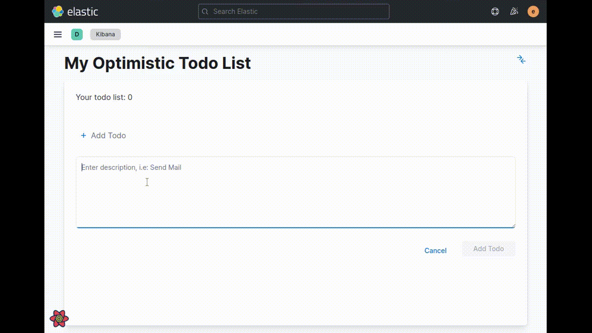

# kibanaOptimisticTodoList

A Kibana plugin to demonstrate the use of Optimistic UI in a TODO list:

## Development

See the [kibana contributing guide](https://github.com/elastic/kibana/blob/main/CONTRIBUTING.md) for instructions setting up your development environment.

## Scripts

<dl>
  <dt><code>yarn kbn bootstrap</code></dt>
  <dd>Execute this to install node_modules and setup the dependencies in your plugin and in Kibana</dd>

  <dt><code>yarn plugin-helpers build</code></dt>
  <dd>Execute this to create a distributable version of this plugin that can be installed in Kibana</dd>
</dl>
